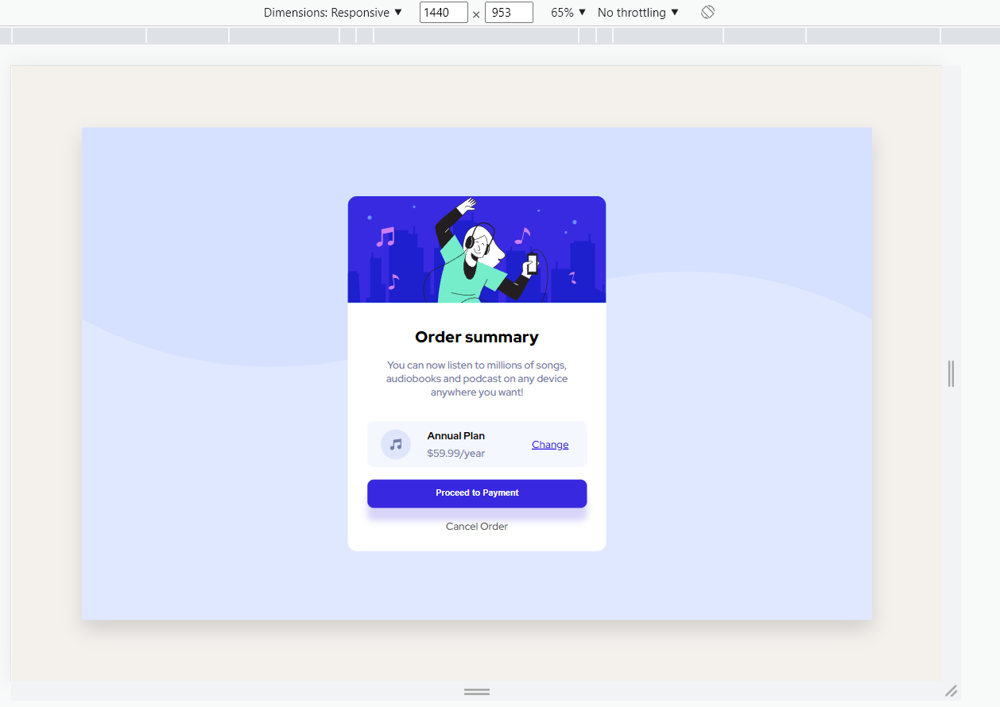
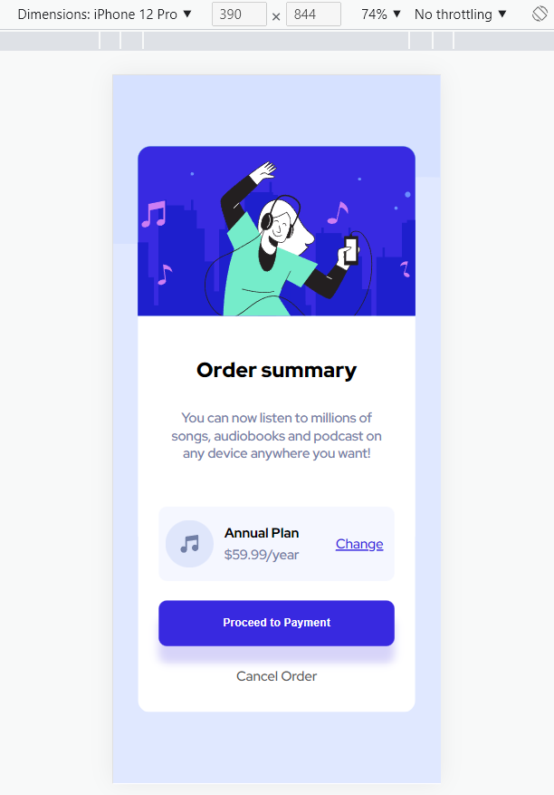

# Make It Real - Profile Card Component

This is a solution to the fifth project of the Make It Real course.

## Table of contents

- [Overview](#overview)
  - [The challenge](#the-challenge)
  - [Solution Screenshot](#solution-screenshot)
- [My process](#my-process)
  - [Built with](#built-with)
  - [What I learned](#what-i-learned)
  - [Continued development](#continued-development)
  - [Useful resources](#useful-resources)
- [Author](#author)
- [Acknowledgments](#acknowledgments)

## Overview

### The challenge

Users should be able to:

- Design a user order summary as close as the screenshot picture of the project.

### Solution Screenshot




## My process

### Built with

- CSS custom properties
- Flexbox
- Media Queries (Breakpoint 500px)
- Semantic HTML5
- Grid property

### What I learned

We learned how to fit the image without modifing aspect ratio: by using object fit property and div tag.

```css
#topImage {
  width: 100%;
  height: 100%;
  object-fit: cover;
}
```

We learned how to use <code>:hover</code> and <code>:focus</code> selectors for styling buttons and links

```css
#paymentButton:hover,
#paymentButton:focus {
  background-color: hsl(245, 75%, 70%);
  cursor: pointer;
}
```

We learned how to use grid property for layout positioning

```css
#summaryPlan {
  display: grid;
  grid-template-columns: repeat(4, 1fr);
  grid-template-rows: 1fr;
  grid-column-gap: 0px;
  grid-row-gap: 0px;
}
```

```css
#musicImage {
  grid-area: 1 / 1 / 2 / 2;
}
```

### Continued development

It will be nice to use React to create the same layout.

### Useful resources

- [Flexbox tutorial](https://www.youtube.com/watch?v=tXIhdp5R7sc) - This helped me figuring out how to use Flexbox properties.
- [Media queries](https://youtu.be/sd16e11blHI) - This is an amazing tutorial for media queries basic concepts.
- [Hover & Focus](https://www.youtube.com/watch?v=i_N-9NRnjNI) - This is an amazing tutorial for the hover and focus selectors basic concepts.
- [Grid property](https://developer.mozilla.org/es/docs/Web/CSS/CSS_Grid_Layout) - This is an amazing grid property resourse.

## Author

- Github - [Juan Velasco](https://github.com/juandiegovelsol)
- Github - [Ivan Cabulo](https://github.com/icabulo)
- Github - [Jaime Fernandez](https://github.com/jfernandez0296)

## Acknowledgments

Kudos to our friends and mentors: Sergio Jaramilo and Daniel Espitia.
